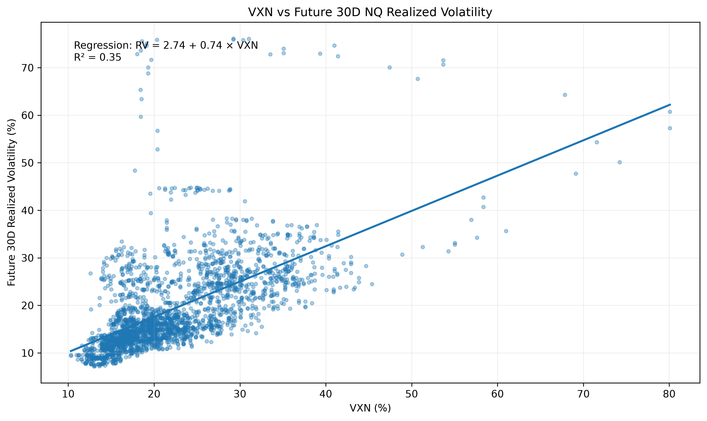
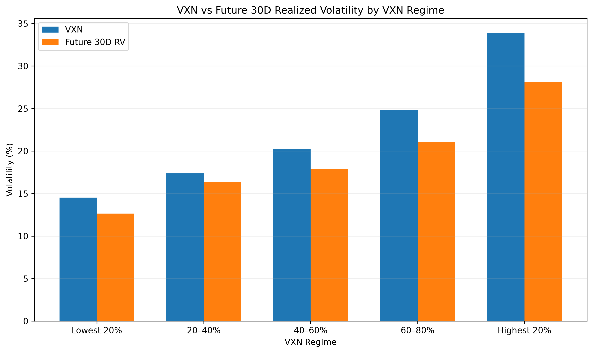
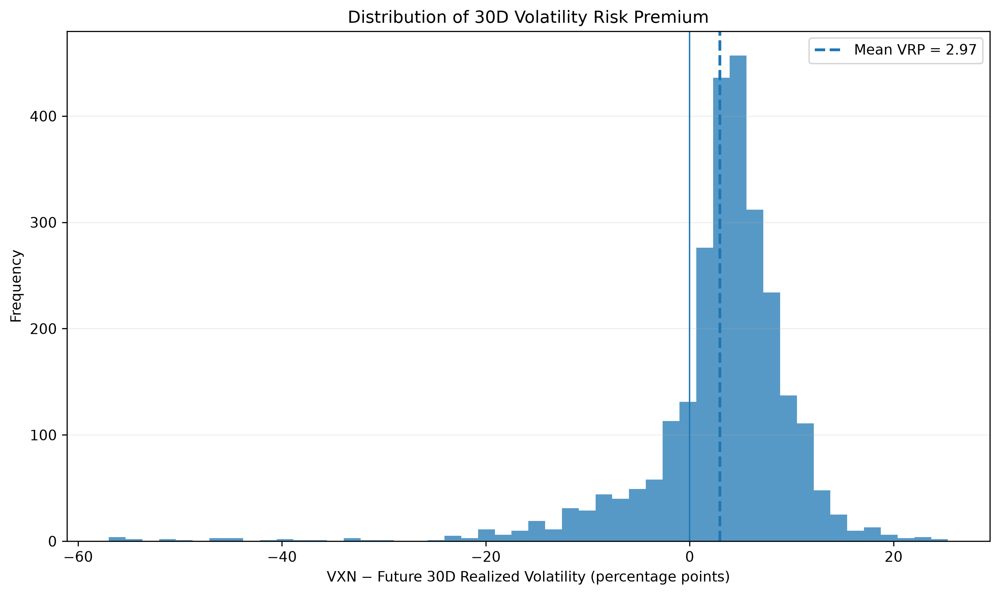
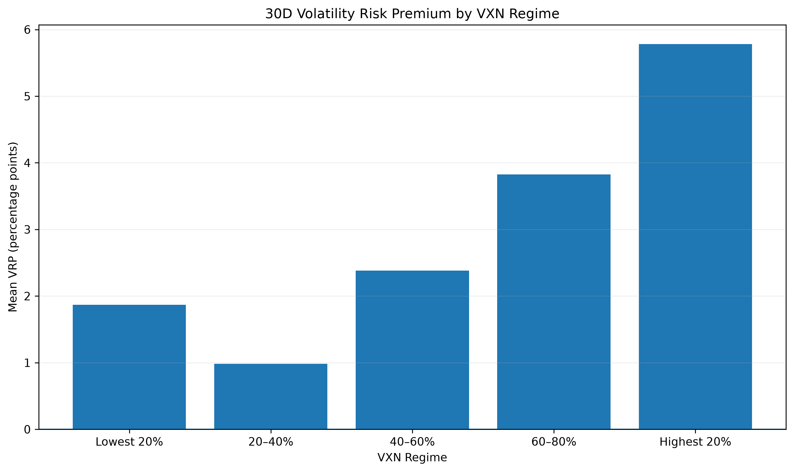
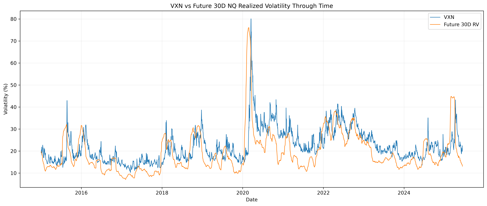

<div align="center">

```
ᴠ ᴏ ʟ ᴀ ᴛ ɪ ʟ ɪ ᴛ ʏ
```

# VXN-Realized-Volatility

Researching the relationship between VXN-implied volatility, subsequent NQ realized volatility, and the volatility risk premium.

[](https://www.python.org/)


</div>

## Research Question

How well does VXN anticipate subsequent realized volatility in Nasdaq-100 futures?

This project measures the relationship between VXN and future NQ realized volatility across 5-day, 10-day, 20-day, and 30-day horizons, with particular focus on:

- The relationship between VXN and subsequent realized volatility
- The calibration of VXN across different volatility regimes
- The volatility risk premium between implied and realized volatility
- The stability of the relationship across different forecast horizons

## Key Findings

The analysis covers NQ 1-minute data from 2015 through July 2025 and compares VXN against subsequent realized volatility over multiple horizons.

| Horizon | Mean VXN | Mean Future RV | Mean VRP | Correlation |
| ------- | -------- | -------------- | -------- | ----------- |
| 5D      | 22.15%   | 18.64%         | +3.51 pp | 0.761       |
| 10D     | 22.16%   | 18.86%         | +3.29 pp | 0.721       |
| 20D     | 22.16%   | 19.15%         | +3.01 pp | 0.650       |
| 30D     | 22.17%   | 19.36%         | +2.81 pp | 0.590       |

Across all horizons, VXN was higher than subsequent realized volatility on average. The average difference declined from approximately 3.51 percentage points at the 5-day horizon to 2.81 percentage points at the 30-day horizon.

The relationship between VXN and future realized volatility was positive across every horizon, with the strongest correlation occurring over 5 days.

### 30-Day Regression

The 30-day regression is:

$$
RV_{30D} = 2.90 + 0.74 \times VXN
$$

with an $R^2$ of approximately $0.35$.

This indicates that higher VXN levels were associated with higher subsequent NQ realized volatility, while VXN also tended to overestimate the magnitude of realized volatility on average.

## Methodology

### Realized Volatility

NQ 1-minute OHLCV data is aggregated into daily CME trading sessions. Intraday log returns are calculated from consecutive 1-minute closing prices.

Daily realized variance is defined as:

$$
RV^2_t = \sum_{i=1}^{n} r_{t,i}^2
$$

where $r_{t,i}$ is the 1-minute log return.

Daily realized volatility is:

$$
RV_t = \sqrt{RV^2_t}
$$

For a future horizon of $H$ trading days, realized volatility is calculated from the cumulative intraday variance over the following $H$ sessions and annualized:

$$
\text{RV}_{H,t}^{\text{annualized}} = \sqrt{ \frac{252}{H} \sum_{j=1}^{H} \text{RV}_{t+j}^2 }
$$

Future realized volatility begins at $t+1$, ensuring that the target does not include the observation date itself.

### Volatility Risk Premium

The volatility risk premium is defined as:

$$
VRP_t = VXN_t - RV_{H,t}
$$

A positive VRP indicates that VXN was higher than subsequent realized volatility.

### Regression

The relationship between VXN and future realized volatility is estimated using ordinary least squares:

$$
RV_{H,t} = \alpha + \beta VXN_t + \epsilon_t
$$

The analysis reports the regression coefficient, intercept, and $R^2$ for each forecast horizon.

### VXN Regimes

VXN observations are divided into five percentile-based groups. Future realized volatility is then compared across the five VXN regimes to examine whether higher implied volatility consistently corresponds to higher subsequent realized volatility.

## Visualizations

### VXN vs Future 30D Realized Volatility

Scatter plot showing the relationship between VXN and subsequent 30-day NQ realized volatility, including the fitted regression line and $R^2$.



### VXN Regimes vs Future Realized Volatility

Mean future realized volatility across five VXN percentile regimes.



### 30D Volatility Risk Premium Distribution

Distribution of the 30-day volatility risk premium, defined as VXN minus subsequent realized volatility.



### VRP by VXN Regime

Mean 30-day volatility risk premium across VXN percentile regimes.



### VXN vs Future 30D Realized Volatility Over Time

Time series comparison of VXN and subsequent 30-day realized volatility.



## Data

### VXN

Daily VXN observations are sourced from the Federal Reserve Bank of St. Louis (FRED).

Source: https://fred.stlouisfed.org/series/VXNCLS

### NQ

NQ 1-minute OHLCV data is sourced from the `mdelcristo/NQ-F_1min_OHLCV_Parquet` dataset on Hugging Face.

Source: https://huggingface.co/datasets/mdelcristo/NQ-F_1min_OHLCV_Parquet

### Data Processing

- NQ timestamps are originally provided in UTC.
- Timestamps are converted to `America/New_York`.
- NQ observations are assigned to CME trading sessions.
- Daily realized variance is calculated from 1-minute log returns.
- VXN is attached to the daily research dataset.
- The original datasets are not included in this repository.
- NQ data currently extends through 2025-07-25.

## Research Pipeline

```text
VXN Data ──────────────┐
                       │
                       ▼
                 Data Attachment
                       │
NQ 1-Minute Data ──────┘
                       │
                       ▼
              Daily Session Aggregation
                       │
                       ▼
             Realized Variance / RV
                       │
                       ▼
              Future RV Calculation
                       │
                       ▼
             VXN vs Future RV Analysis
                       │
             ┌─────────┼─────────┐
             ▼         ▼         ▼
         Regression  Quintiles   VRP
             │         │         │
             └─────────┼─────────┘
                       ▼
                Visualizations
````

## Project Structure

```text
.
├── data/
│   ├── attached/          # NQ data with VXN attached
│   ├── daily/             # Aggregated daily research data
│   ├── parquets/          # Source NQ Parquet files
│   ├── vxn/               # Source VXN data
│   └── data_source.md     # Data sources and processing notes
│
├── src/
│   ├── attach.py          # Attach VXN observations to NQ data
│   ├── aggregate_daily.py # Aggregate NQ sessions and calculate RV
│   └── measure_hypothesis.py # Calculate research statistics
│
├── visualization/
│   ├── plot.py            # Generate research visualizations
│   └── output/            # Generated research figures
│
├── README.md
├── requirements.txt
└── .gitignore
```

## Reproducibility

### Requirements

Python 3.x is required.

Install the project dependencies:

```bash
pip install -r requirements.txt
```

### Data Setup

Download the NQ 1-minute Parquet data and VXN daily data from the sources listed in `data/data_source.md`.

Place the NQ Parquet files in:

```text
data/parquets/
```

Place the VXN data in:

```text
data/vxn/
```

### Run the Pipeline

Attach VXN observations to the NQ data:

```bash
python src/attach.py
```

Aggregate the NQ sessions into daily observations:

```bash
python src/aggregate_daily.py
```

Run the hypothesis analysis:

```bash
python src/measure_hypothesis.py
```

Generate the visualizations:

```bash
python visualization/plot.py
```

The resulting research figures are written to:

```text
visualization/output/
```

The analysis is deterministic given the same source datasets and processing configuration.

## Limitations

The current analysis is an initial research implementation rather than a production trading model.

* **Point-in-time VXN alignment:** VXN is currently attached using calendar-date alignment. A strict predictive implementation should align each VXN observation to the exact timestamp at which it became available and measure only subsequent NQ returns.
* **NQ data coverage:** The current NQ dataset ends on 2025-07-25.
* **Daily VXN frequency:** VXN is available at daily frequency, while NQ is sampled at 1-minute frequency.
* **Overlapping horizons:** The 10D, 20D, and 30D future-volatility observations overlap substantially, so observations are not fully independent across dates.
* **No trading costs:** The analysis measures the statistical relationship between implied and realized volatility and does not model transaction costs, slippage, execution, or position sizing.
* **Research-stage results:** Statistical relationships identified in the historical sample should not be interpreted as evidence of future trading profitability.

## License

This project is licensed under the MIT License. See [LICENSE](LICENSE) for details.

The license applies to the code in this repository. External datasets remain subject to their respective source licenses and terms of use.
